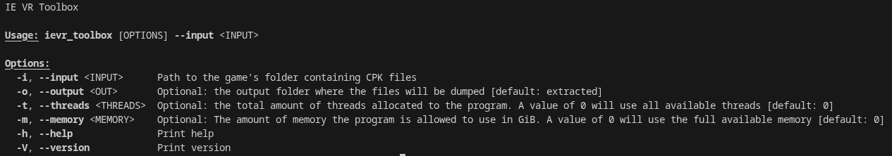

# IE VR Toolbox

This program aims at being a collection of utilities for making modding Inazuma Eleven Victory Road easier. The code is heavily based of both [Viola](https://github.com/SuperTavor/Viola) and [CriFsV2Lib](https://github.com/Sewer56/CriFsV2Lib), but re-written in Rust for performance. On top of that, heavy parallelism is used to make the best possible use of one's computer's ressources.

The selective dumping is possible thanks to my work on [IEVR Cfg Bin Editor](https://github.com/Telmo26/ievr_cfg_bin_editor) that is currently a work in progress.

# Features

- **Dumping**: This is the main reason for this existing, and its only use as of now. The tool dumps game files significantly faster than Viola. However, the dumping process is heavily I/O-bound, so the faster your storage the faster the program will go. Conversely, a slow HDD will probably not see a huge difference in performance. As of now, only total dumps are supported, but partial dumps after updates and dumping specific files are planned for the future.

    - Partial dumping: This tool supports selecting the files you want to dump. To do so, first create a text file. Each line of the text file must contain a valid [regular expression](https://en.wikipedia.org/wiki/Regular_expression). Every file from the game whose filename (not the directory!) matches one of the regular expressions will be extracted. You then pass the text file to the program using the `-r` or `--rules-file` argument.

# Usage

The tool is only available as a CLI tool for now, as I prefer focusing on adding features before making a GUI. 

It is available for both Windows and Linux. Rust compiles static binaries, so the Linux version should be compatible with most x86_64 distributions. 

A help menu is available by typing `ievr_toolbox -h` or `ievr_toolbox --help`. You can set the input folder, the output folder, the number of threads allocated to the program and the amount of RAM available, and the file selection.

# AI disclosure
AI was used extensively for this project, mainly to help me understand the purpose of some of the code from the original libraries, since my knowledge of C# is pretty limited.